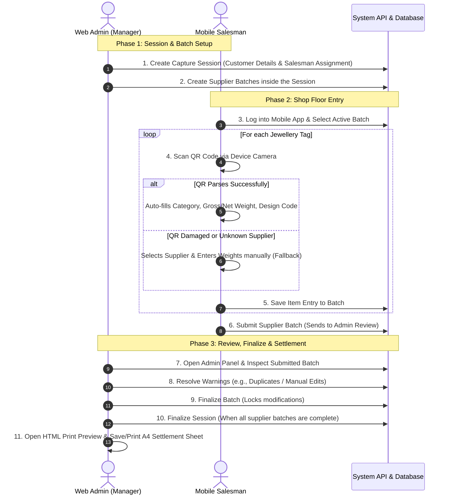
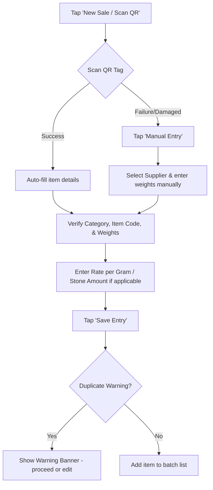

# Palak Jewellery — System User Guide & Navigation Flow

Welcome to the **Palak Jewellery Sales & Settlement Management System**. This guide provides a simple walkthrough of how the system operates, how to navigate the **Mobile App** and the **Web Admin Panel**, and how they coordinate to complete a secure transaction.

---

## 1. System Roles

The system is designed for two main roles:
1. **Salesman (Mobile App User)**: Works on the shop floor scanning jewellery tags and submitting sales batches.
2. **Administrator / Manager (Web Admin Panel User)**: Configures system parameters, starts/assigns sessions, reviews transactions, and prints settlement sheets.

---

## 2. Core User Flow Diagram

The diagram below shows the complete lifecycle of a sales and settlement workflow:

---

## 3. Mobile App Navigation (Salesman Flow)

The mobile app is optimized for speed on the shop floor. A salesman should be able to scan and record a sale in under 60 seconds.

### Step 3.1: Log In
* Open the mobile app.
* Enter your assigned email address and password.
* Click **Login**.

### Step 3.2: Select Active Batch
* Upon logging in, you will see your **Dashboard** showing today's totals (sales count and weight sold).
* Click **View Assigned Sessions/Batches**.
* Select the active batch for the supplier you are currently scanning for.

### Step 3.3: QR Scanner & Data Verification

* **Happy Path**: Scan the QR code on the jewellery tag. The app automatically detects the supplier, item/design code, karat, and weight fields. Enter any missing details (like rate/stone charges) and tap **Save**.
* **Fallback Path (Damaged QR)**: If the scanner cannot read the tag, tap **Manual Entry**, select the supplier from the list, manually type the weights, and tap **Save**. 
* **Duplicate Warnings**: If the same item tag is scanned twice on the same day, a warning banner is displayed. You can choose to override it or cancel.

### Step 3.4: Submit Batch
* Once all pieces from the supplier are scanned and verified, tap the **Review Batch** button on the screen.
* Confirm the total items count and gross weight match your physical items.
* Tap **Submit Batch**. The batch is locked on mobile and sent to the Admin Panel for review.

---

## 4. Web Admin Panel Navigation (Manager Flow)

The web dashboard is accessed via desktop/laptop browsers. It gives owners and managers full control over suppliers, configurations, session audits, and printing.

### Step 4.1: Supplier & QR Configuration
To ensure the mobile app can parse your supplier tags, navigate to **Suppliers**:
* **Add Supplier**: Register the supplier with their Name, Code, Address, and payment info.
* **Configure QR Strategy**: Map how the QR strings are read (Delimiter-based, Fixed Position, or JSON).
* **QR Test Tool**: Paste a raw QR string from the supplier into the test input area to instantly verify if weights, categories, and item codes are parsing correctly.

### Step 4.2: Session Management
Navigate to **Capture Sessions**:
* Click **Create Session**.
* Enter Customer Name, Phone, and Reference Note.
* Assign a Salesman.
* Add Supplier Batches to the session (each batch corresponds to one supplier).

### Step 4.3: Reviewing & Finalizing Batches
Navigate to **Settlement Workflow**:
* Look for batches marked **Submitted**.
* Click **Review**.
* Check the **Warnings & Exceptions Panel**: It alerts you to duplicate scans, manual overrides, or weight mismatches.
* If everything is correct, click **Finalize Batch**.
* When all supplier batches in a session are complete, click **Finalize Session**.

### Step 4.4: Print & PDF Settlement Exports
Once finalized, you can print reports directly from the browser print engine:
* Select the report type:
  * **Session Combined Report**: The master invoice showing grouped summaries for all suppliers in the session.
  * **Supplier Section Report**: Individual supplier-specific transaction breakdown.
  * **Item Ledger**: Overall list of item audits.
* Click **Print Preview**.
* A portrait A4 document container will open in a new tab featuring the Palak Jewellery branding.
* Click **Print / Save PDF** in the floating toolbar. Select **Save as PDF** or print directly to your physical printer.

---

## 5. Summary Checklist for Success

| Action | Done By | Tool | Key Requirement |
| :--- | :--- | :--- | :--- |
| Set up Supplier QR rules | Admin | Web Panel | Test via the QR Test Tool |
| Start Session & Assign | Admin | Web Panel | Enter correct Customer Phone/Notes |
| Scan Jewellery Tags | Salesman | Mobile App | Ensure correct active batch selection |
| Submit Batch | Salesman | Mobile App | Verify physical piece counts first |
| Audit & Finalize | Admin | Web Panel | Resolve warnings in Exceptions Panel |
| Print Settlement PDF | Admin | Web Panel | Use Portrait A4 browser print engine |
